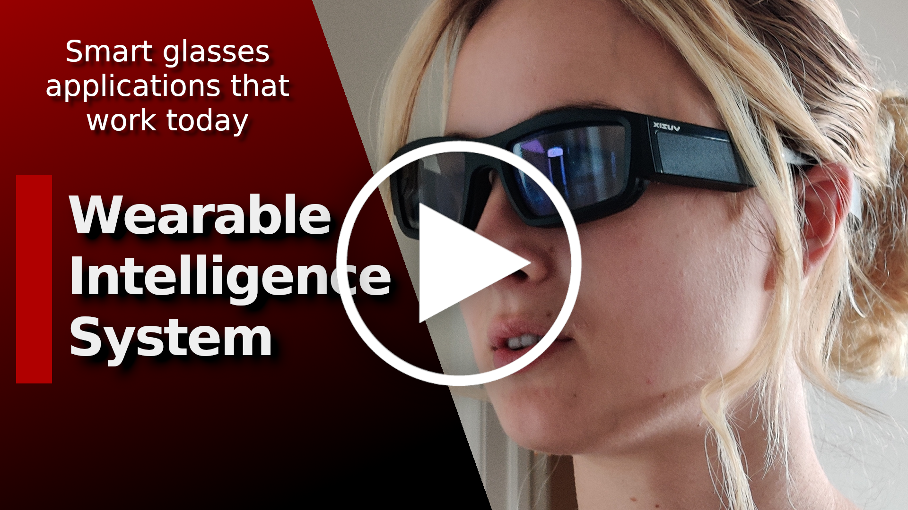

# Wearable Intelligence System

The Wearable Intelligence System (WIS) is the homepage for your smart glasses. The WIS makes aims to make using smart glasses valuable, easy, useful, and fun. It does so with a host of built-in apps, voice controls, always available HUD information, an app launcher, and more. There's a number of powerful and fashionable smart glasses being released, and the WIS gives you an interface and apps to make those glasses useful. The WIS is like your phone homescreen or your computer desktop combined with a smart assistant.

## What It Can Do Now

We're working hard to add use cases to the system. Here's a list of what it can already do:

### Users

#### Fully functional: 

- Search - Search the web with voice, see immediate results on your HUD.
- Ask Questions - Ask an intelligent voice assistant any question, see answers on your HUD.
- Remember More - Memory tools to expand your memory with information recording and recall.
- Visual Search - Define anything that you see. Find images with similiar content as your point-of-view (POV) camera image.
- Live Captions - Improve understanding and retention in conversations, meetings, lectures, etc. with live closed captions overlaid on your vision at all times.
- Autociter / Wearable Referencer - Auto-associative voice search through a personal database, send relevant links to conversation partners over SMS.
- Name Memorizer - Never forget a name again with HUD notifications when you see a familiar face

#### In Progress: 

- Live Translation - Translate live foreign language speech into your native language, and silently read the output on the screen.
- Social Tools - Improve emotional intelligence with affective computing running on your point-of-view, giving live insights into the non-verbal communication around you.
- Egocentric/POV Recording - Record your egocentric camera, audio, location, transcripts, all with easy voice commands.
- Much more

### Developers

The WIS makes is a software framework that makes it easy to build smart glasses applications. Checkout the [Documentation](#documentation) for more information.
 
## How To Use 

You will need two pieces of hardware to run the system:  

- ASP - Android Smart Phone
- ASG - Android Smart Glasses (Supported: Vuzix Blade)

#### Initial One Time Setup

Here's the setup you have to do the very first time you want to setup the system:  

1. On your Android smart phone, download the "Wearable Intelligence System" app:
    - (RECCOMENDED) Play Store: <TODO>
    - F-droid: <TODO>
    - [Github latest release](https://github.com/emexlabs/WearableIntelligenceSystem/releases)
2. On your smart glasses, download the "Wearable Intelligence System" app:
    - (RECCOMENDED) Vuzix Store: <TODO>
    - F-froid: <TODO>
    - [Github latest release](https://github.com/emexlabs/WearableIntelligenceSystem/releases)
3. 
    * Launch the "Wearable Intelligence System" app on your smart phone
    * Accept permissions.
    * Tap "Start Wifi Hotspot", turn on (configure password if necessary) your wifi hotspot, then go "Back" to return
4. Connect smart glasses WiFi to the smart phone WiFi hotspot
5. Enable mobile data (or wifi sharing) on Android smart phone
6. Start "Wearable Intelligence System" application on smart glasses
7. 
    * The phone connection icon will be green if the glasses are connected to your phone. If you speak, you'll see a live transcript on the smart glasses screen.
    * On the Android smart phone, got to "Memory Tools" -> "Memory Stream" and you will see live transcripts
8. Setup complete.

#### Subsequent Launch
    
Here's how to launch the system after you've already done the initial setup above:  

1. Launch "WIS" app on smart phone
2. Enable mobile hotspot on smart phone with the "Start WiFi Hotspot" button
3. Connect Android smart glasses to Android smart phone WiFi hotspot.
4. Launch "WIS" app on smart glasses.
5. Verify system is running by the "Smart Glasses Conection Indicator" icon turning green.

## Voice Commands

All voice commands must be preceded by a `wakeword`. A `wakeword` is any word you choose to "wake up" the system and start listening to commands.
    
#### Wakewords
- hey computer
- licklider
    
#### Voice Commands

- `save speech <note>` - save any voice note to your cache of notes. This can be used to save ideas, thoughts, notes, reminders, etc.
- `save speech tag <tagname> <note>` - save any voice note to your cache of notes and to a specific tag bin named <tag>
- `quick query <query>` - ask a question to an intelligence assistant
- `search for <query` - search the web for anything, see the intelligently chosen top result
- `switch modes translate <language>` - live translate the given language into english
- `switch modes live life captions` - display live closed captions
- `switch modes blank mode` - blank the screen
- `switch modes visual search` - use a POV image to search the web for anything that you see around you
    
### Modes
 
#### Live Life Captions
 
Closed captions of everything you and those around you say. Live view of commands and commmand output. Nouns in transcripts are highlighted. Soon to be extended to give definition, summary, encylopedia, and NLP functionalities.
 
#### Social Mode
 
A social-emotional intelligence tool to be used in social situations. Live metrics about the social environment (eye-contact, facial emotion, high-level psychological metrics (e.g. stress, confidence, etc.)) overlaid on the users vision. This is experimental and not recommended for real world use.
 
#### Blank Mode
 
Blanks the screen, sleep mode.

## Documentation
    
The docs are hosted on this repo's Wiki, [here are the docs](https://github.com/emexlabs/WearableIntelligenceSystem/wiki).
    
## Abbreviations

ASP - Android Smart Phone  
ASG - Android Smart Glasses  
GLBOX - GNU/Linux 'Single Board Computer'/Laptop  

## Authors

Cayden Pierce - [emexwearables.com](https://emexwearables.com)
